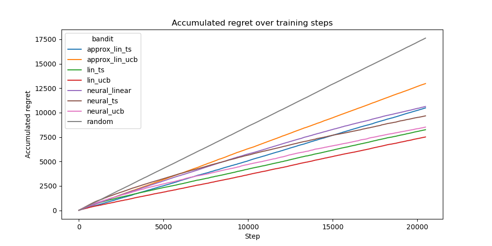
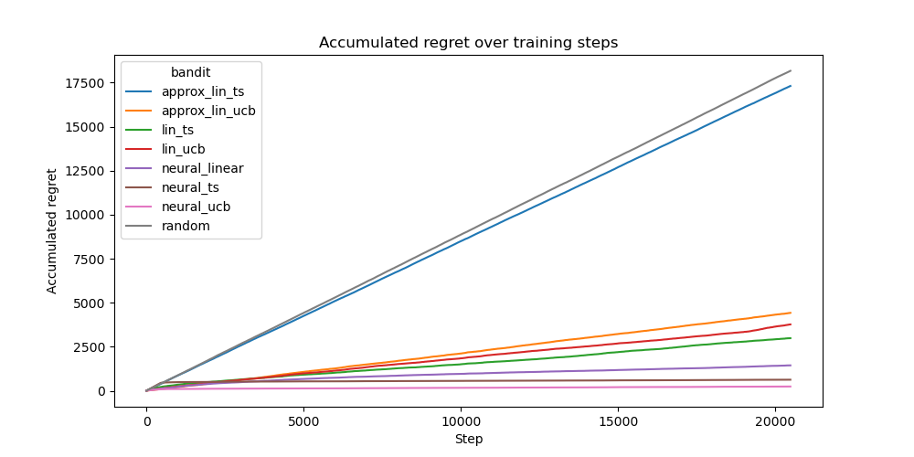
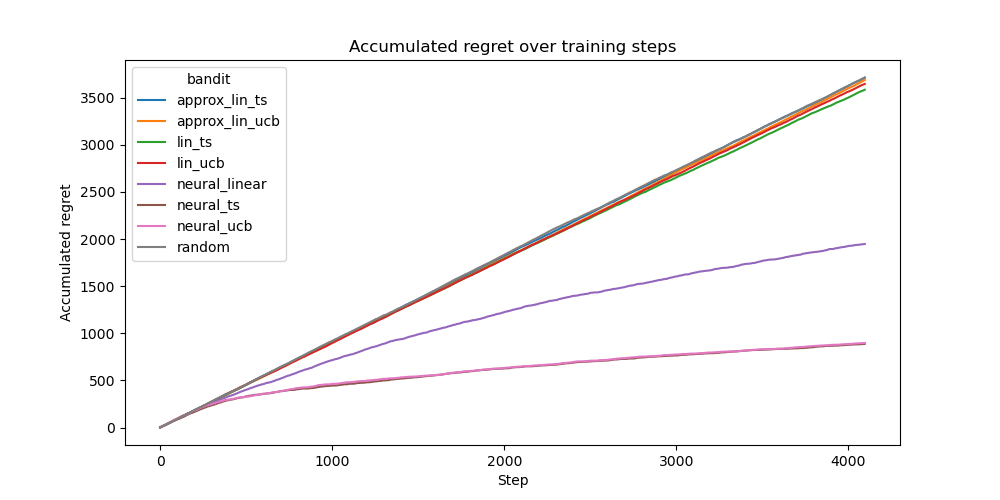
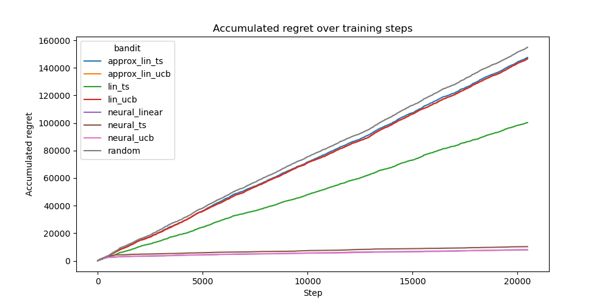
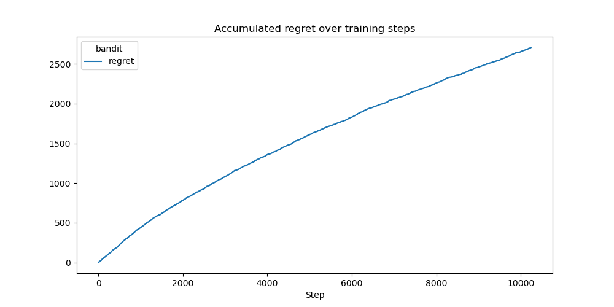
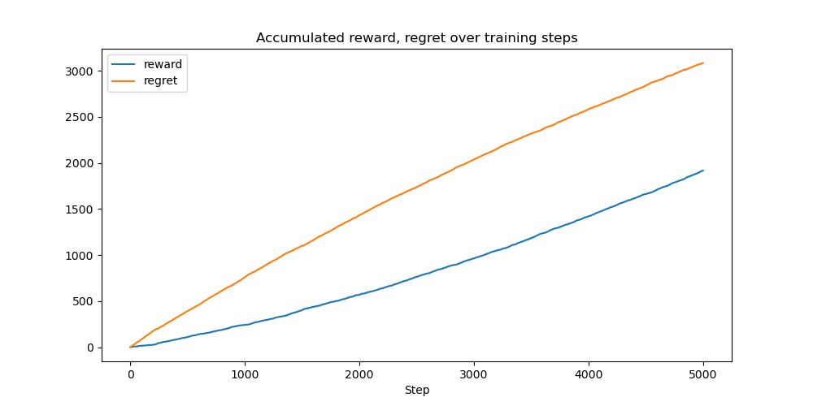
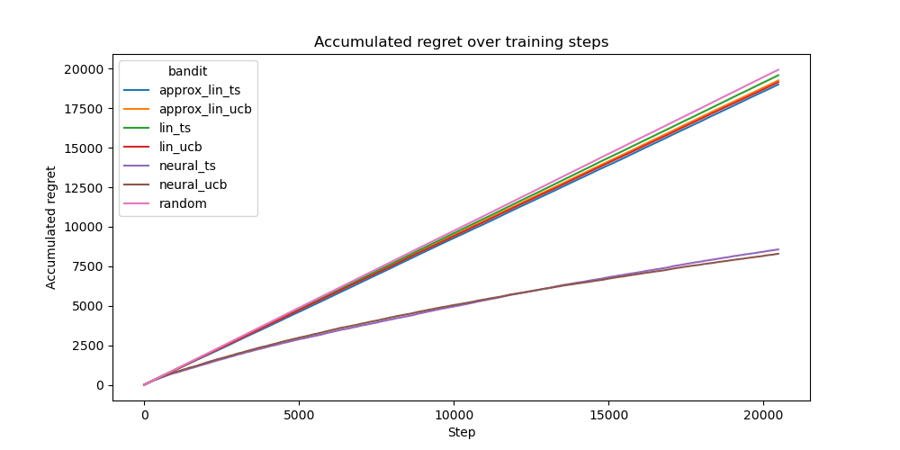
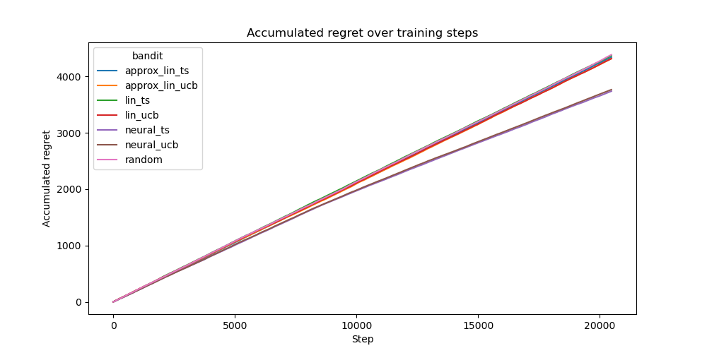
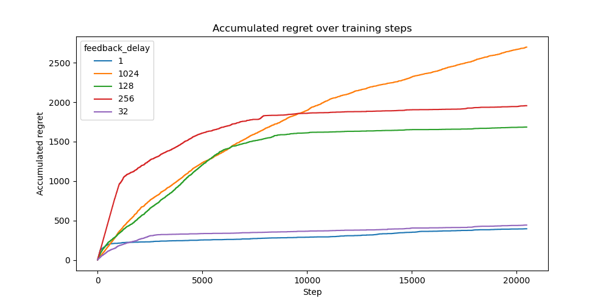

The results of the benchmark comparing different algorithms and settings.

# Datasets
This is an overview over the benchmark parameters:
### Bandit Variants Tested:
- random
- lin_ts
- approx_lin_ts
- lin_ucb
- approx_lin_ucb
- neural_linear
- neural_ts
- neural_ucb

### Further Parameters
- `max_samples` in each training step: 20480
- `selector`: ArgMaxSelector
- `feedback_delay`: 1
- `forward_batch_size`: 1

- `max_steps`: 1024
- `train_batch_size`: 100
- `gradient_clip_val`: 20.0
- `network`: "small_mlp" (3 hidden layer with 128 units + ReLU activation)
- `max_buffer_size`: 10240

### Bandit arguments
- `exploration_rate`: 0.00001
- `learning_rate`: 0.0001
- `weight_decay`: 0.00001
- `min_samples_required_for_training`: 128
- `initial_train_steps`: 1024
- `n_embedding_size`: 64
- `eps`: 0.1

We used a fixed seed.

Please see the documentation for details on the specific datasets.

## Covertype
Difficult standard Machine Learning dataset:

## Statlog (Shuttle)
Simple standard Machine Learning dataset:

## MNIST
Simple image classification:

## Wheel
This is a synthetic bandit dataset, designed for challenging exploration:

## IMDB Reviews
This is a natural language classification dataset:

## Tiny ImageNet
This is a more challenging image recognition dataset.

## MovieLens
This is a combinatorial dataset for movie recommendation:

## Synthetic Combinatorial (cosine)
This is a synthetic bandit dataset, designed for challenging exploration:

# Special Settings

## Feedback Delays
We evaluate how different delays of feedback impacted the performance of NeuralUCB:

