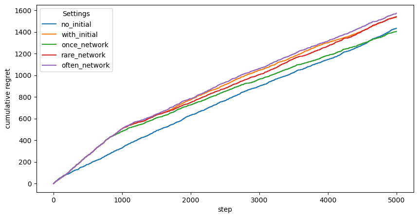

# Neural Linear with BERT for IMDB Movie Reviews

This experiment investigates the application of the Neural Linear bandit algorithm for training large-scale Natural Language Processing models like transformers, specifically focusing on a BERT architecture. We aim to assess whether such an approach enables efficient adaptation in a bandit setting.

## Experimental Setup

### Dataset

The evaluation is conducted using the IMDB Moview Reviews dataset. The bandit model receives a movie review in text form as input and has to decide whether the review is positive or negative, corresponding to the predicted class label. A correct classification yields a reward of `1.0`, while incorrect classifications result in a reward of `0.0`. The maximal token length is 256.

Overall, we train on a corpus of 5000 samples. Both classes are roughly equally represented.

### Model Architecture

A pre-trained **BERT** encoder variant (`google/bert_uncased_L-2_H-128_A-2`), serves as the feature extractor. The model outputs 128-dimensional embeddings. These embeddings are passed through a disjoint contextualizer, and then fed into a Linear Thompson Sampling head, forming a Neural Linear model. As a tokenizer `bert-base-uncased` is utilized which padds the inputs to 256 tokens.

### Training and Hyperparameters

Training is conducted using the Adam optimizer with mean squared error (MSE) loss. The following hyperparameter configuration is employed:

- Batch size: `100`
- Learning rate: `0.0001`
- Weight decay: `0.00001`
- Gradient clipping: `20.0`
- Early stopping: Training halts if the average batch loss falls below `0.001`.
- Precision matrix regularization: A small positive constant (`eps = 1.0`) is added to the diagonal to ensure numerical stability in Thompson Sampling.

In general, the Neural Linear model employs distinct update strategies for the neural feature extractor and the Thompson Sampling head:

- The neural network undergoes initial pretraining for `initial_train_steps`.

- Beyond this phase, the network is only updated every `min_samples_required_for_training` samples (or not at all). The network is never reset (`warm_start=True`) and trained for `max_steps`. For each step one batch of samples is randomly drawn out of the last 1024 observed samples (`window_size`).

- The Thompson Sampling head is updated more frequently:

    - It is fully recomputed on all available data after each network training phase (if they exist).

    - When the network is not trained, the head is updated solely using the newly observed samples.

We evaluate four different training strategies ranging from no network updates to often network updates:

|               | `initial_train_steps` | `min_samples_required_for_training` | `max_steps` |
|:--------------|----------------------:|------------------------------------:|------------:|
| no_initial    |                    0  |                                None |        None |
| with_initial  |                 1024  |                                None |           5 |
| once_network  |                 1024  |                                2501 |           5 |
| rare_network  |                 1024  |                                1024 |           5 |
| often_network |                 1024  |                                 128 |           2 |

### Evaluation Metric

Performance is assessed using the average regret over the entire 5000 samples. The regret quantifies the discrepancy between the observed rewards and the optimal achievable rewards.

## Results

These results are unexpected. Firstly, the model without initial training of the network, and therefore, also no training of the network later, performs the best for a long time. This could very well be explained by the other methods overfitting on the initial data. From the methods with initial training, the method with very rare network updates performs best which actually overtakes the first method. The worst performing method is the one with the most updates of the neural network. It is likely that this is dependent on this dataset or the BERT model itself if the pre-trained model can already solve this relatively easy task quite well.

## Conclusion

This study demonstrates that the Neural Linear model can adapt a pretrained BERT model to a bandit learning Natural Language setting. Interestingly, we find that training the network less often leads to better results.

## References

- Riquelme et al. (2018). "Deep Bayesian Bandits Showdown: An Empirical Comparison of Bayesian Deep Networks for Thompson Sampling."

- Devlin et al. (2018). "BERT: Pre-training of Deep Bidirectional Transformers for Language Understanding"
