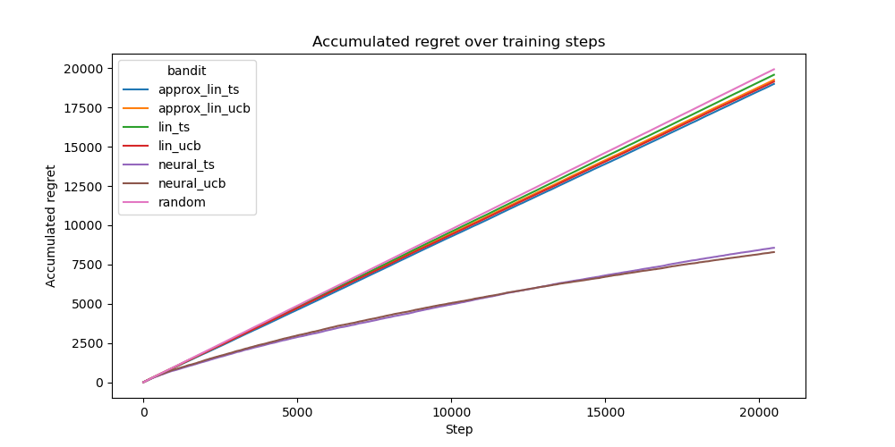
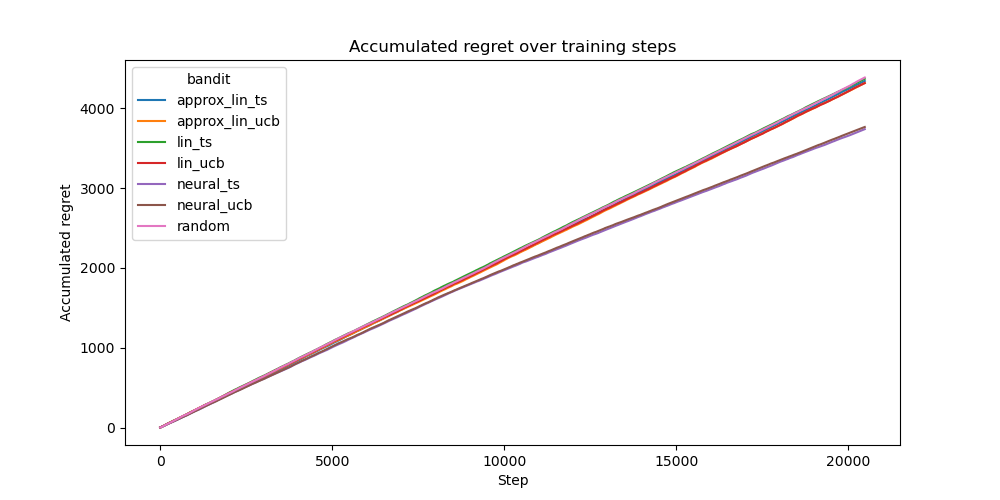

# Benchmark on Combinatorial Bandits

Here we present the results of benchmark experiments conducted on our implementations of the combinatorial multi-armed bandit algorithms. The goal is to compare their performance on different datasets, evaluated on the accumulative regret metric. We expect the neural algorithms to outperform the linear bandits due to its superior representation power.

## Experimental Setup

### Bandit Algorithms
In general, we want to evaluate the performance of the following bandit algorithms:

- CombLinTS

- CombLinUCB

- CombNeuralTS

- CombNeuralUCB

Also, we compare the algorithms against a random baseline where the bandit always choses a random set of actions.

### Datasets
We evaluate each algorithm on the following datasets, from which 20480 random samples are drawn and passed to the bandit sequentially:

- **MovieLens**: a dataset for a combinatorial bandit setting performing movie recommendations for users. The context is the outer product of the user and movie features, which is based on Li et al. "A contextual-bandit approach to personalized news article recommendation". For a given user the bandit selects 4 movies. The reward depends on how many of the selected movies were actually watched by the user in the future.

- **Synthetic Combinatorial Datasets**: we evaluate the model on further non-linear synthetic datasets in a combinatorial setting with 40 features, as done in Hwang et al. "Combinatorial Neural Bandits". We randomly sample contexts from a unit ball and compute the reward with a non-linear function like the cosine of the inner product of the context vectors.

### Neural Network & Training
For the neural bandits we use a small MLP which consists of 3 hidden layers with 128 units and ReLU activations.
For Neural Linear the resulting embedding size is 64.

Training is conducted using the Adam optimizer with mean squared error (MSE) loss. The following hyperparameter configuration is used:

- Batch Size: `100`

- Learning Rate: `0.0001`

- Weight Decay: `0.00001`

- Gradient clipping: `20.0`

- Early stopping: Training halts if the average batch loss falls below `0.001`.

The neural network undergoes initial pretraining for 1024 steps.
Beyond this phase, the network is only updated every 128 samples and is trained on all of the last 10240 data points (if there are less available, then it is trained on all data). The network is not reset before training.

Finally, there are some more hyper-parameters for the bandits:

- The bandits always chose a super arm constisting of 4 arms. 

- `exploration_rate`: `0.00001` (for UCB based algorithms, also called alpha)

- `eps`: varying between `0.01` and `1.0` across datasets. Adjusted per dataset so that algorithm does not fail.

All models are evaluated on the same seed.

### Evaluation Metric
Bandits are evaluated based on the accumulated regret after predicting actions for each sample in the dataset.

## Results

### MovieLens

### Synthetic Combinatorial (cosine)

## Conclusion
Overall, we find that the neural bandits perform better than the linear bandits. Especially, for the real-world MovieLens dataset one can see this very nicely.

It is unexpected that the neural bandits do not seem to learn the cosine synthetic dataset but it might be due to hyperparameters or the specific seed, as the cosine datasets can vary greatly in difficulty. One should rerun the experiment for several seeds.

## Citations
- Zhou et al. "Neural Contextual Bandits with UCB-based Exploration"
- Zhang et al. "Neural Thompson Sampling"
- Riquelme et al. "Deep Bayesian Bandits Showdown: An Empirical Comparison of Bayesian Deep Networks for Thompson Sampling"

## Citations
- Li et al. "A contextual-bandit approach to personalized news article recommendation" https://arxiv.org/abs/1003.0146
- Hwang et al. "Combinatorial Neural Bandits" https://arxiv.org/abs/2306.00242
