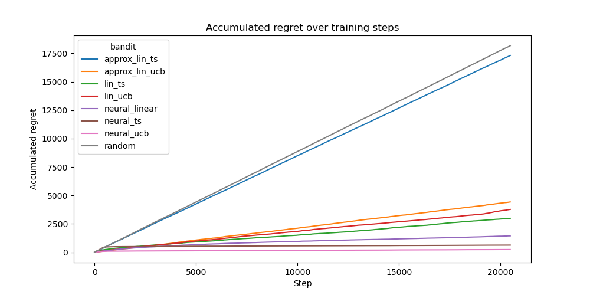

# Benchmark on Linear and Neural Bandits

Here we present the results of benchmark experiments conducted on our implementations of the neural and linear contextual multi-armed bandit algorithms. The goal is to compare their performance on different datasets, evaluated on the accumulative regret metric. We expect the neural algorithms to outperform the linear bandits due to its superior representation power.

## Experimental Setup

We use a similar setup as in the papers describing the algorithms in the *Citations*.

### Bandit Algorithms
In general, we want to evaluate the performance of the following bandit algorithms:

- Linear Thompson Sampling

- Approximate Linear Thompson Sampling

- LinUCB

- Approximate LinUCB

- Neural Linear

- Neural Thompson Sampling

- NeuralUCB

Also, we compare the algorithms against a random baseline where the bandit always choses a random action.

### Datasets
We evaluate each algorithm on the following datasets, from which 20480 random samples are drawn and passed to the bandit sequentially:
- **Covertype**: A relatively difficult imbalanced machine learning dataset with 7 classes and 64 features. We use the disjoint model to create contextualized actions.

- **Statlog (Shuttle)**: An easier imbalanced machine learning dataset with We use the disjoint model to create contextualized actions.

- **MNIST**: A standard Machine Learning dataset with 10 classes and 784 features of hand-written digids classification. We use the disjoint model to create contextualized actions.

- **Synthetic Wheel Dataset**: Introduced by Riquelme et al., 2018 this dataset is designed for a challenging exploration, exploitation tradeoff. Has two features and 5 arms. The contextualized actions are sampled from a unit circle and the rewards are assigned to certain areas of the circle if the chosen arm was correct.

### Neural Network & Training
For the neural bandits we use a small MLP which consists of 3 hidden layers with 128 units and ReLU activations.
For Neural Linear the resulting embedding size is 64.

Training is conducted using the Adam optimizer with mean squared error (MSE) loss. The following hyperparameter configuration is used:

- Batch Size: `100`

- Learning Rate: `0.0001`

- Weight Decay: `0.00001`

- Gradient clipping: `20.0`

- Early stopping: Training halts if the average batch loss falls below `0.001`.

The neural network undergoes initial pretraining for 1024 steps.
Beyond this phase, the network is only updated every 128 samples and is trained on all of the last 10240 data points (if there are less available, then it is trained on all data). The network is not reset before training.

Finally, there are two more hyper-parameters for UCB and TS based algorithms:

- `exploration_rate`: `0.00001` (for UCB based algorithms, also called alpha)

- `eps`: varying between `0.01` and `1.0` across datasets. Adjusted per dataset so that algorithm does not fail.

All models are evaluated on the same seed.

### Evaluation Metric
Bandits are evaluated based on the accumulated regret after predicting actions for each sample in the dataset.

## Results
We find that the neural algorithms always outperform the random baseline. Except for Covertype the neural algorithms also always outperform the linear algorithms. The approximate algorithms perform worse than the non-approximate variations. Other than on Covertype NeuralUCB seems to perform the best with this hyperparameter configuration. It is not clear why the linear bandits outperform the neural bandits on the Covertype dataset. 

### Covertype

### Statlog (Shuttle)

### MNIST

### Wheel

## Conclusion
Overall, we find that the neural bandits perform better than the linear bandits. NeuralUCB seems to perform the best. We can confirm most of the findings from the original papers even if the hyperparameter configurations were slightly different.

## Citations
- Zhou et al. "Neural Contextual Bandits with UCB-based Exploration"
- Zhang et al. "Neural Thompson Sampling"
- Riquelme et al. "Deep Bayesian Bandits Showdown: An Empirical Comparison of Bayesian Deep Networks for Thompson Sampling"