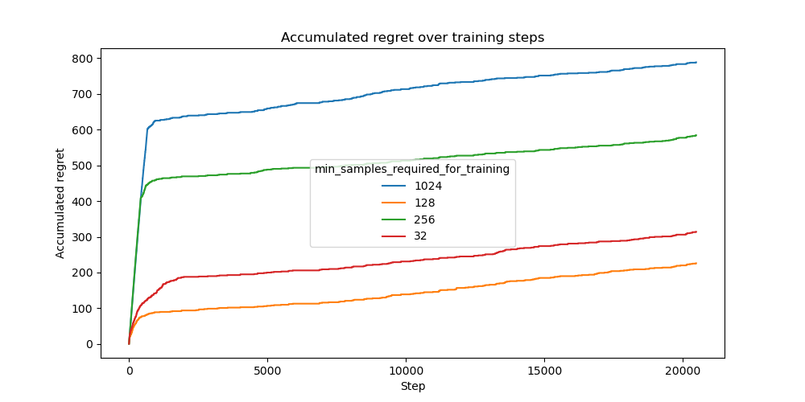

# Delayed Feedback Setting Experiment

This experiment investigates the impact of different feedback delays in a multi-armed bandit setting. A feedback delay occurs when a bandit receives multiple forward samples before obtaining the corresponding rewards. We evaluate how different feedback delays influence the accumulated regret of the Neural UCB algorithm.

## Experimental Setup

### Dataset

The experiment is conducted on the Statlog (Shuttle) dataset. The bandit receives inputs sampled from this dataset, as a disjoint model, and must make a decision based on the given observations. Correct decisions yield a reward of `1.0`, while incorrect decisions result in a reward of `0.0`.

The experiment is conducted over a total of `20480` samples.

### Model Architecture

We employ a **Neural UCB** bandit model with a small **MLP network** with three hidden layers of 128 units each and ReLU activation. For optimization we use Adam and an MSE loss.

### Training and Hyperparameters

Training is conducted using the Adam optimizer with the following hyperparameter configuration:

- Learning rate: `0.0001`
- Weight decay: `0.00001`
- Exploration rate: `0.00001`
- Batch size: `100`
- Gradient clipping: `20.0`
- Forward batch size: `1`. The samples are passed one by one so that the uncertainty updates are happening live.

Every time the bandit receives a batch of feedback, the network is updated with all of the available data out of the last 10240 observed samples.

### Feedback Delay Variations

We analyze the effect of different feedback delay settings, where the model does not immediately receive rewards but instead accumulates multiple forward samples before obtaining the corresponding feedback. The evaluated feedback delay values are:

- `1`
- `32`
- `128`
- `256`
- `1024`

### Evaluation Metric

Performance is assessed based on accumulated regret over `20480` training samples. The regret quantifies the discrepancy between the observed rewards and the optimal achievable rewards.

## Results

### Feedback Delay Experiment

#### Regret Analysis

The results indicate that **faster feedback leads to lower regret**, which aligns with expectations. However, an interesting observation is that the delay setting `256` performs significantly worse during the initial training phase compared to other delay values before stabilizing later in training. The delay setting `1024` exhibits consistently high regret, suggesting that extreme delays hinder learning efficiency.

### Initial Training Steps Experiment

We evaluate how different values for `initial_train_steps`, which determines the number of updates performed before making decisions, impact performance. The tested values are:

- `0`
- `512`
- `1024`

#### Regret Analysis

The results show that increasing `initial_train_steps` reduces regret. Notably, training the model for `512` steps before making decisions significantly improves performance, while `1024` steps further improve but with diminishing returns.

### Training Interval Experiment

We compare different values for `min_samples_required_for_training`, which specifies how often training occurs. The tested values are:

- `32`
- `128`
- `256`
- `1024`

#### Regret Analysis

The results indicate that `128` performs best, slightly better than `32`. This was unexpected because it trains less frequently but might be due to overfitting. `256` performs considerably worse, and `1024` is even worse, both as expected.

## Discussion

One problem with this setup is that when the model trains more often, it also overall sees more data. It would be interesting to find out how the performance compares when the overall number of data points is the same but training happens more frequently with fewer samples.

## Conclusion

This study demonstrates that reducing feedback delay improves the performance of the Neural UCB bandit model. While expected, the particularly poor initial performance of the `256` delay setting highlights potential instability in moderate feedback delays. Additionally, proper selection of `initial_train_steps` and `min_samples_required_for_training` is crucial, with `512` initial training steps and a training interval of `128` samples showing the best results. Further investigation is needed to better understand these trade-offs.

