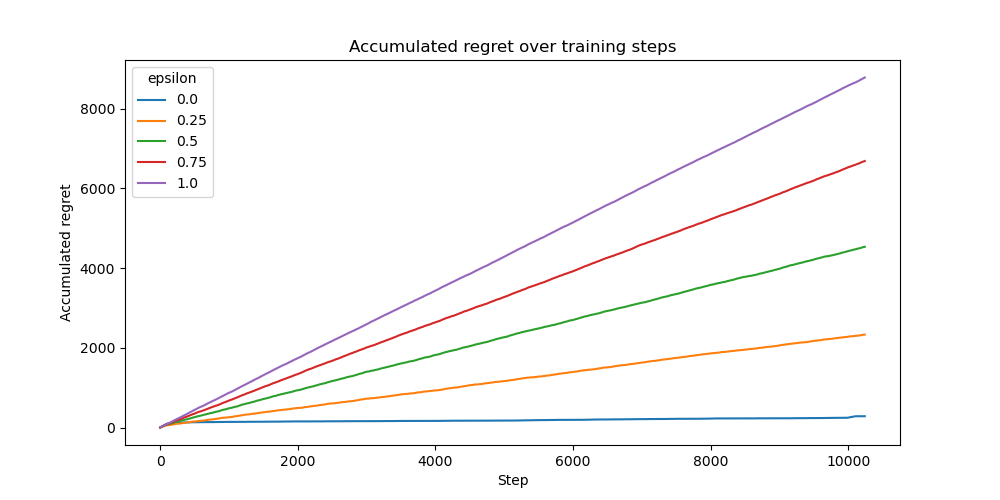

# Epsilon-Greedy Exploration Strategies for Neural Bandits

This experiment investigates the effect of different exploration rates ($\epsilon$ values) in an epsilon-greedy selector on the performance of a Neural UCB bandit algorithm. We aim to assess the exploration-exploitation trade-off and its impact on regret minimization.

## Experimental Setup

### Dataset

The experiment is conducted on the Statlog (Shuttle) dataset. The bandit receives inputs sampled from this dataset, as a disjoint model, and must make a decision based on the given observations. Correct decisions yield a reward of `1.0`, while incorrect decisions result in a reward of `0.0`.

Overall, we train on a corpus of 10,240 samples randomly selected from the full dataset.

### Model Architecture

We employ a **Neural UCB** bandit model with a small **MLP network** consisting of three hidden layers of 128 units each and ReLU activation. For optimization, we use Adam and an MSE loss.

### Training and Hyperparameters

The following hyperparameter configuration is employed:

- Batch size: `32`
- Gradient clipping: `20.0`
- Weight decay: `0.00001`
- Exploration rate: `0.00001` (for Neural UCB's internal exploration)
- Initial training steps: `1024`
- Buffer strategy: All available data is used for training
- Maximum buffer size: `10240` samples

For exploration, we test epsilon-greedy with values of `0.0`, `0.25`, `0.5`, `0.75`, and `1.0`, where:

- `0.0` means pure exploitation (always select the best action)
- `1.0` means pure exploration (always select random actions)

### Evaluation Metric

Performance is assessed using the average regret over all seen samples. The regret quantifies the discrepancy between the observed rewards and the optimal achievable rewards.

## Results

## Conclusion

This experiment reveals that for the Neural UCB algorithm on the Statlog dataset, an exploitation-focused strategy (lower $\epsilon$ values) significantly outperforms exploration-heavy approaches. This suggests that the Neural UCB's internal exploration mechanism already provides sufficient exploration, making additional random exploration unnecessary.

These findings highlight the importance of carefully tuning exploration parameters in bandit algorithms, as excessive exploration can substantially degrade performance when the underlying model already has effective built-in exploration capabilities.
