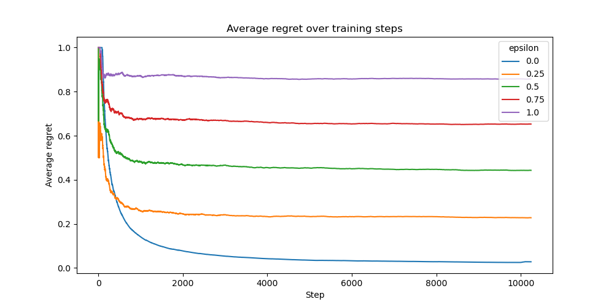

# Epsilon-Greedy Exploration Strategies for Neural Bandits

This experiment investigates the effect of different exploration rates ($\epsilon$ values) in an epsilon-greedy selector on the performance of a Neural UCB bandit algorithm. We aim to assess the exploration-exploitation trade-off and its impact on regret minimization.

## Experimental Setup

### Dataset

The evaluation is conducted using the Statlog dataset, which contains satellite image data categorized into 7 classes. Each context consists of 49 features representing multi-spectral values of pixels in 3x3 neighborhoods of satellite imagery. The bandit must predict the correct land-use category, with correct classifications yielding higher rewards.

Overall, we train on a corpus of 10,240 samples randomly selected from the full dataset.

### Model Architecture

We employ a **Neural UCB** bandit model with a **small MLP network** consisting of three hidden layers of 128 units each and ReLU activation. The neural network learns feature representations that are then used by the bandit algorithm to make decisions.

### Training and Hyperparameters

The following hyperparameter configuration is employed:

- Batch size: `32`
- Gradient clipping: `20.0`
- Weight decay: `0.00001`
- Exploration rate: `0.00001` (for Neural UCB's internal exploration)
- Initial training steps: `1024`
- Embedding size: `64`
- Buffer strategy: All available data is used for training
- Maximum buffer size: `10240` samples

For exploration, we test epsilon-greedy with values of `0.0`, `0.25`, `0.5`, `0.75`, and `1.0`, where:

- `0.0` means pure exploitation (always select the best action)
- `1.0` means pure exploration (always select random actions)

### Evaluation Metric

Performance is assessed using the average regret over all seen samples. Lower regret indicates better performance, as it means the algorithm is closer to selecting optimal actions.

## Results

The results demonstrate a clear relationship between exploration rate and regret:

- **Epsilon = 0.0** (pure exploitation) achieves the lowest average regret, reaching near-zero values after sufficient training.
- **Epsilon = 0.25** shows moderately increased regret but maintains good performance.
- **Epsilon = 0.5** results in significantly higher regret.
- **Epsilon = 0.75** shows even further degradation in performance.
- **Epsilon = 1.0** (pure random exploration) consistently maintains the highest regret.

All configurations exhibit high regret in the initial training phase, but those with lower epsilon values converge more quickly to better performance.

## Conclusion

This experiment reveals that for the Neural UCB algorithm on the Statlog dataset, an exploitation-focused strategy (lower epsilon values) significantly outperforms exploration-heavy approaches. This suggests that:

1. The Neural UCB's internal exploration mechanism may already provide sufficient exploration, making additional random exploration unnecessary.
2. The statlog dataset may have relatively clear patterns that are quickly learned, reducing the need for extensive exploration.
3. The exploration-exploitation trade-off strongly favors exploitation in this particular task.

These findings highlight the importance of carefully tuning exploration parameters in bandit algorithms, as excessive exploration can substantially degrade performance when the underlying model already has effective built-in exploration capabilities.
