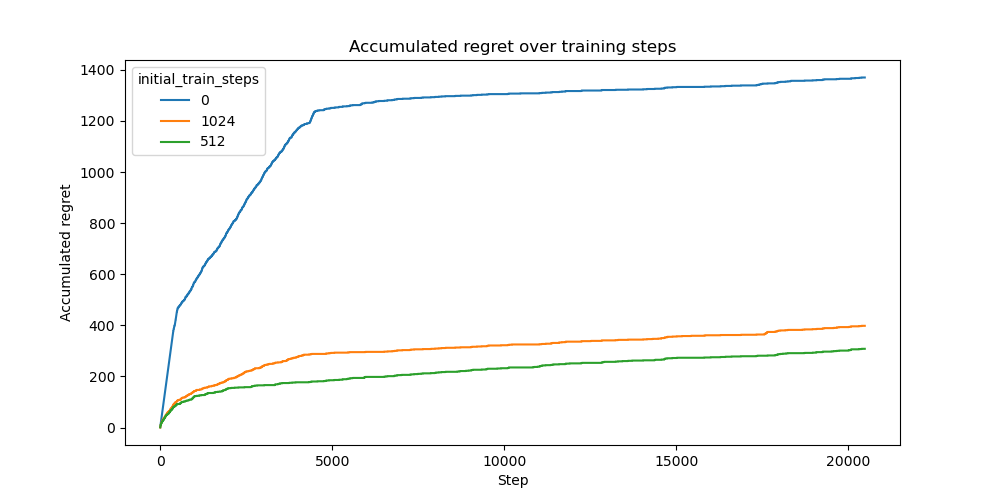

# Initial Training Steps Experiment

This experiment investigates the impact of different initial training step durations in a multi-armed bandit setting. The initial training phase determines how long the model is updated after every observation before switching to standard batch updates. We evaluate how different initial training step durations influence the accumulated regret of the Neural UCB algorithm.

## Experimental Setup

### Dataset

The experiment is conducted on the Statlog dataset. The bandit receives inputs sampled from this dataset, as a disjoint model, and must make a decision based on the given observations. Correct decisions yield a reward of `1.0`, while incorrect decisions result in a reward of `0.0`.

The experiment is conducted over a total of `20480` samples.

### Model Architecture

We employ a **Neural UCB** bandit model with a small **MLP network** with three hidden layers of 128 units each and ReLU activation. For optimization we use Adam and a MSE loss.

### Training and Hyperparameters

Training is conducted using the Adam optimizer with the following hyperparameter configuration:

- Learning rate: `0.0001`

- Weight decay: `0.00001`

- Exploration rate: `0.00001`

- Batch size: `100`

- Gradient clipping: `20.0`

The Neural UCB model undergoes an initial pretraining phase for a varying number of steps before transitioning to the standard update schedule. The tested initial training step values are:

- `0`
- `512`
- `1024`

### Evaluation Metric

Performance is assessed based on accumulated regret over `20480` training samples. The regret quantifies the discrepancy between the observed rewards and the optimal achievable rewards.

## Results

### Regret Analysis

The results indicate that **longer initial training phases lead to lower accumulated regret**. The model with `0` initial training steps shows the worst performance, accumulating the highest regret throughout training. Increasing the number of initial training steps to `512` and `1024` results in significantly lower regret, indicating that early training stabilization benefits the bandit's decision-making process.

## Conclusion

This study demonstrates that incorporating an extended initial training phase improves the performance of the Neural UCB bandit model. The results highlight the importance of early training in mitigating regret and improving long-term decision-making.
