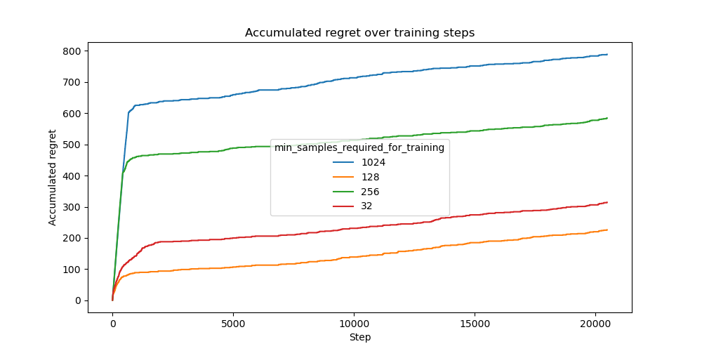

# Training Interval Experiment

This experiment investigates the impact of different training intervals in a multi-armed bandit setting. The training interval determines how often the model updates based on accumulated data before making new decisions. We evaluate how varying the minimum number of samples required for training influences the accumulated regret of the Neural UCB algorithm.

## Experimental Setup

### Dataset

The experiment is conducted on the Statlog (Shuttle) dataset. The bandit receives inputs sampled from this dataset, as a disjoint model, and must make a decision based on the given observations. Correct decisions yield a reward of `1.0`, while incorrect decisions result in a reward of `0.0`.

The experiment is conducted over a total of `20480` samples.

### Model Architecture

We employ a **Neural UCB** bandit model with a small **MLP network** with three hidden layers of 128 units each and ReLU activation. For optimization, we use Adam and an MSE loss.

### Training and Hyperparameters

Training is conducted using the Adam optimizer with the following hyperparameter configuration:

- Learning rate: `0.0001`

- Weight decay: `0.00001`

- Exploration rate: `0.00001`

- Batch size: `100`

- Gradient clipping: `20.0`

Every time the bandit receives a batch of feedback, the network is updated with all of the available data out of the last `10240` observed samples.

### Training Interval Variations

We analyze the effect of different training interval settings, where the model requires a minimum number of accumulated samples before training occurs. The evaluated values are:

- `32`

- `128`

- `256`

- `1024`

### Evaluation Metric

Performance is assessed based on accumulated regret over `20480` training samples. The regret quantifies the discrepancy between the observed rewards and the optimal achievable rewards.

## Results

The results show that `128` performs best, slightly outperforming `32`. This was unexpected because it trains less frequently, but the improved performance might be due to reduced overfitting. As expected, `256` performs significantly worse, and `1024` is even worse, indicating that updating too infrequently hinders learning efficiency.

## Discussion

One problem with this setup is that when the model trains more often, it also sees more data overall. It would be interesting to find out how the performance compares when the total amount of data is the same, but training happens more frequently with fewer data per update.

## Conclusion

This study demonstrates that adjusting the training interval impacts the performance of the Neural UCB bandit model. While frequent training can reduce regret, excessive updates may lead to overfitting. Further investigation is needed to isolate the effects of training frequency from the total data volume seen by the model.

