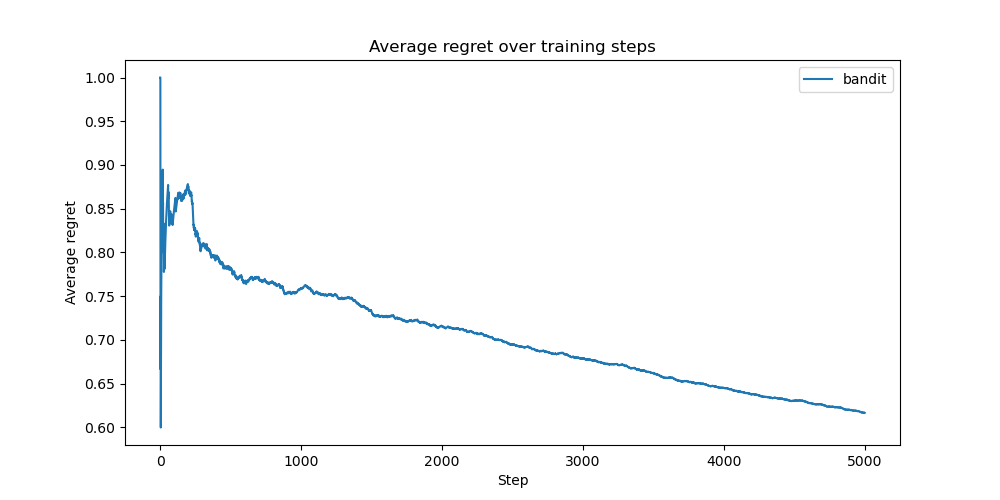
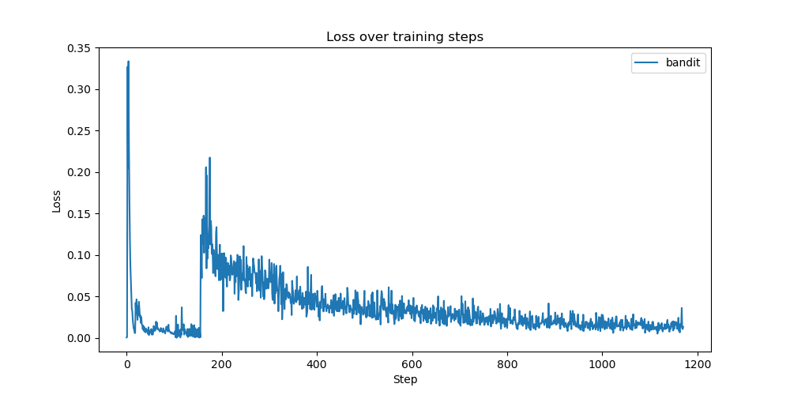

# Neural Linear with ResNet for Tiny ImageNet

This experiment investigates the application of the Neural Linear bandit algorithm for training large-scale image classification models, specifically focusing on a ResNet architecture. We aim to assess whether such an approach enables efficient adaptation in a bandit setting.

## Experimental Setup

### Dataset

The evaluation is conducted using the Tiny ImageNet dataset, a reduced variant of the ImageNet dataset designed for classification tasks. To control feature dimensionality and ensure computational feasibility, we restrict the dataset to the first 10 classes. The bandit model receives a 64×64 RGB image as input and selects one of 10 possible actions, corresponding to the predicted class label. A correct classification yields a reward of `1.0`, while incorrect classifications result in a reward of `0.0`.

Each class in the training set contains 500 samples, resulting in an overall training corpus of 5000 images.

### Model Architecture

A **ResNet-18** variant (`resnet18.a1_in1k`), pretrained on ImageNet, serves as the feature extractor. The classification head is removed, and the model outputs 512-dimensional embeddings. These embeddings are passed through a disjoint contextualizer, and then fed into a Linear Thompson Sampling head, forming a Neural Linear model.

### Training and Hyperparameters

Training is conducted using the Adam optimizer with mean squared error (MSE) loss. The following hyperparameter configuration is employed:

- Batch size: `100`
- Learning rate: `0.0001`
- Weight decay: `0.00001`
- Gradient clipping: `20.0`
- Early stopping: Training halts if the average batch loss falls below `0.001`.
- Precision matrix regularization: A small positive constant (`eps = 0.1`) is added to the diagonal to ensure numerical stability in Thompson Sampling.

The Neural Linear model employs distinct update strategies for the neural feature extractor and the Thompson Sampling head:
- The neural network undergoes initial pretraining for the first 128 samples (`initial_train_steps`).
- Beyond this phase, the network is updated every 128 samples (`min_samples_required_for_training`). The network is always trained on the full set of observed data without being reset.
- The Thompson Sampling head is updated more frequently:
    - It is fully recomputed on all available data after each network training phase.
    - When the network is not trained, the head is updated solely using the newly observed samples.

### Evaluation Metric

Performance is assessed using cumulative regret and average regret. The regret quantifies the discrepancy between the observed rewards and the optimal achievable rewards.

## Results

### Regret Analysis

The accumulated regret over time is illustrated below:

Initially, regret increases linearly, but the growth rate gradually diminishes. The mean regret across the entire experiment is `0.62`.

A breakdown by time period reveals that the initial 100 steps exhibit an average regret of `0.85`, while the final 100 steps yield an improved average regret of `0.47`. 

As a baseline, random action selection would result in an expected regret of `0.9`. The Neural Linear model significantly outperforms random selection after sufficient training. Notably, the pretrained ResNet embeddings alone do not confer substantial performance improvements over random selection. An explanation for this is given in the Discussion section.

### Loss Dynamics

The following plot presents the training loss trajectory:

Each plotted step corresponds to a network update step of a single batch. The initial loss decline represents the pretraining phase, where the model repeatedly encounters the same samples, leading to overfitting. Once the pretraining phase concludes, an influx of novel samples causes a transient spike in loss, followed by a gradual decline as more data points are revisited over time.

## Discussion

The observed loss dynamics underscore the potential for hyperparameter optimization to enhance bandit learning efficiency. Particularly, the choice of training frequency for the neural network could impact stability and convergence.

Furthermore, [prior analyses](https://github.com/tjmoon0104/Tiny-ImageNet-Classifier?tab=readme-ov-file) of pretrained ResNet models on Tiny ImageNet see reference indicate that adjusting the input resolution from 64×64 to 224×224 significantly enhances performance. This suggests that the discrepancy between the pretraining dataset (ImageNet) and Tiny ImageNet may hinder feature extraction, contributing to the limited initial performance observed.

## Conclusion

This study demonstrates that the Neural Linear model effectively adapts a pretrained ResNet to a bandit learning setting. While initial regret remains high, the model progressively improves decision-making efficiency with increased training. Future work may explore architectural modifications and refined training schedules to optimize convergence.

## References

- Riquelme et al. (2018). "Deep Bayesian Bandits Showdown: An Empirical Comparison of Bayesian Deep Networks for Thompson Sampling."

- Wightman, R., Touvron, H., & Jégou, H. (2021). "ResNet Strikes Back: An Improved Training Procedure in timm." NeurIPS 2021 Workshop on ImageNet: Past, Present, and Future.