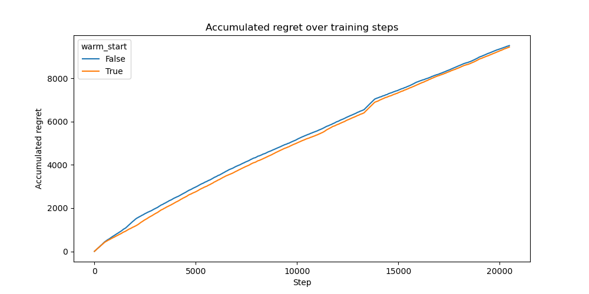

# Training Frequency Experiment

This experiment investigates the differences between a warm start and a cold start training of the Neural Linear bandit algorithm. Every time neural linear has to update its network we can either reset the network and train it from scratch using all of the previously observed data (cold start) or don't reset the network and only train on a sample from the recent history called the sliding window. We aim to find the difference in effects between these two methods.

## Experimental Setup

### Dataset

The evaluation is conducted using the Covertype dataset. The contexts are passed to the bandit as a disjoint model. A correct classification yields a reward of `1.0`, while incorrect classifications result in a reward of `0.0`. Overall, we train on a corpus of 20480 samples.

### Model Architecture

We employ a **Neural Linear** bandit model with a small **MLP network** with three hidden layers of 128 units each and ReLU activation.

### Training and Hyperparameters

Training is conducted using the Adam optimizer with mean squared error (MSE) loss. The following hyperparameter configuration is employed:

- Batch size: `100`
- Learning rate: `0.0001`
- Weight decay: `0.00001`
- Gradient clipping: `20.0`
- Early stopping: Training halts if the average batch loss falls below `0.001`.
- Precision matrix regularization: A small positive constant (`eps = 0.01`) is added to the diagonal to ensure numerical stability in Thompson Sampling.

We turned off the initial training phase. We now compare two approaches `cold_start` and `warm_start`.

For `cold_start` the minimal amount of samples required for training is defined as `512`. Therefore, every `512` steps we reset the model and use the entire data buffer for training. It is trained on up to 100 batches of the available data in the buffer.

For `warm_start` we also train every `512` samples but we do not reset the model and we only sample 10 batches out of the last 2048 samples.

### Evaluation Metric

Performance is assessed using the average regret over all seen samples. The regret quantifies the discrepancy between the observed rewards and the optimal achievable rewards.

## Results

There is no real difference visible between warm and cold starts.

## Conclusion

This study demonstrates that the Neural Linear model can be trained both with warm and cold starts. Further experiments have to be conducted to find the advantages and disadvantages of the two methods.
