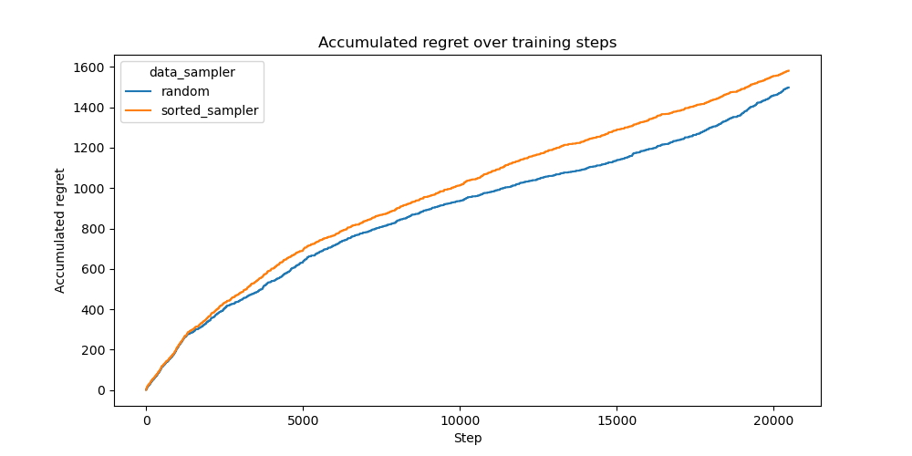

# Non i.i.d. Setting

This experiment investigates the effect of passing the data in a non i.i.d. setting to the Neural Linear bandit algorithm, specifically passing. We aim to assess whether this has an effect on the performance of the bandit.

## Experimental Setup

### Dataset

The evaluation is conducted using the MNIST dataset. The bandit model receives a context encoding an image as input and has to perform hand-written digit recognition. A correct classification yields a reward of `1.0`, while incorrect classifications result in a reward of `0.0`.

Overall, we train on a corpus of 20480 samples. All classes are roughly equally represented. In the non i.i.d. setting we sort the images by label before passing them to the bandit, i.e. first passing all zeros, then all ones, etc., and finally all nines.

### Model Architecture

We employ a **Neural Linear** bandit model with a small **MLP network** with three hidden layers of 128 units each and ReLU activation.

### Training and Hyperparameters

Training is conducted using the Adam optimizer with mean squared error (MSE) loss. The following hyperparameter configuration is employed:

- Batch size: `100`
- Learning rate: `0.0001`
- Weight decay: `0.00001`
- Gradient clipping: `20.0`
- Early stopping: Training halts if the average batch loss falls below `0.001`.
- Precision matrix regularization: A small positive constant (`eps = 1.0`) is added to the diagonal to ensure numerical stability in Thompson Sampling.

We turn off the initial training phase. The bandit is trained every 128 samples with 16 batches of size 100, randomly sampled from the last 8192 steps.

### Evaluation Metric

Performance is assessed using the average regret over all seen samples. The regret quantifies the discrepancy between the observed rewards and the optimal achievable rewards.

## Results

Interestingly, there is no strong effect visible. As expected the sorted data setting performs slightly worse because the strong cutoffs can be avoided where only new data is available.

## Conclusion

We studied the effect of non-i.i.d. sorted sampling but we could not find a strong result.